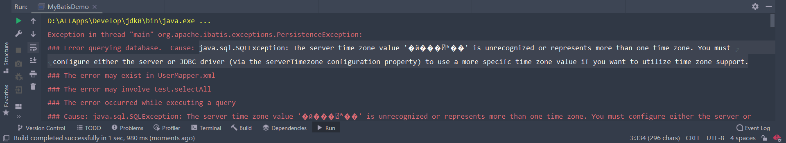
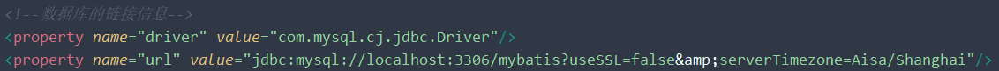

# 👾BUG 日志记录

 

## 🤯系统找不到指定的路径(properties)

 

具体信息：

java.io.FileNotFoundException: jdbc-demo\src\druid.properties (系统找不到指定的路径。)

 

解决方法：

1. 首先通过 `System.getProperty("user.dir")` 获取当前所在项目的路径

    

2. 检查项目的路径有没有模块名，如果打印的路径有模块名，那么代码中就不需要模块名

   

成功排除bug

 

## 🫤@Test报错

 

具体信息：

Annotations are not allowed here 且只有Remove选项

 

 

解决方法：

只要你写完代码就行了😓（无语。。。。找了半天错误，结果就这🙃

 

## 🐻pom.xml 没有 properties

 

## 😳serverTimezone未设置

 

具体信息：

java.sql.SQLException: The server time zone value '�й���׼ʱ��' is unrecognized or represents more than one time zone. You must configure either the server or JDBC driver (via the serverTimezone configuration property) to use a more specifc time zone value if you want to utilize time zone support.

 

解决方法：

从控制台的报错信息可以得知，错误在没有设置 `serverTimezone`

在MySQL 8.X版本中需要传入时区信息，故需要在 `mybatis-config.xml` 配置文件中添加 `serverTimezone=Asia/Shanghai`

 

>在XML中，直接使用一些符号会出差错，所以我们就会一些实体名称来代替

参考文章：

[serverTimezone错误](https://blog.csdn.net/weixin_44096353/article/details/118715116)

[对实体 "serverTimezone" 的引用必须以 ';' 分隔符结尾](https://www.bbsmax.com/A/VGzl4gg8zb/)