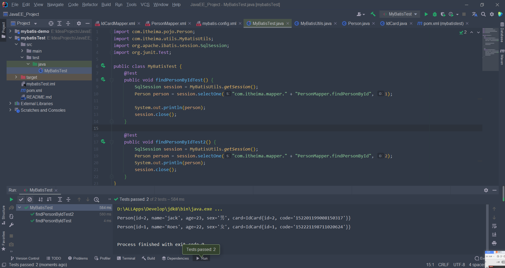
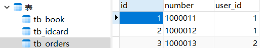
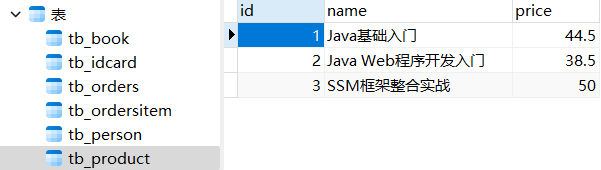
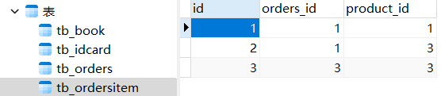
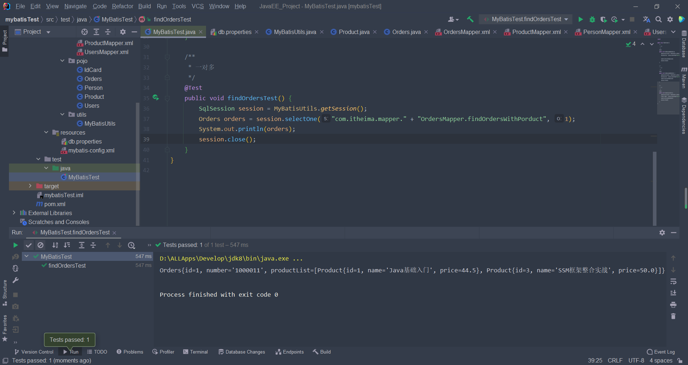
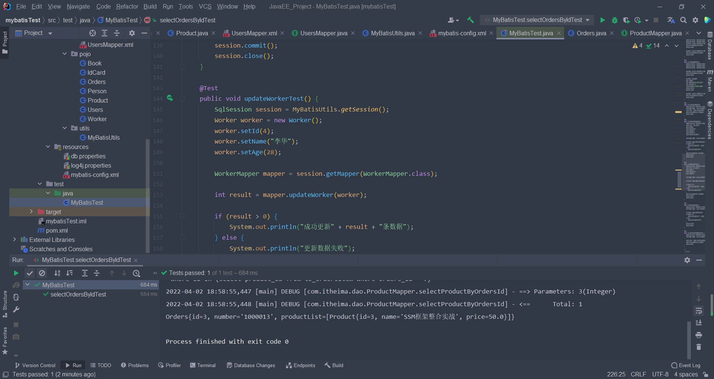

# 说明文档

学号：20561340401

姓名：叶子庆

## 第一次作业

MyBatis 数据库代码：

~~~java
use mybatis;
create table tb_idcard (
id int primary key auto_increment,
code varchar(18)
);
insert into tb_idcard(code) values ('152221198711020624');
insert into tb_idcard(code) values ('152201199008150317');
create table tb_person (
id int primary key auto_increment,
name varchar(32),
age int,
sex varchar(8),
card_id int unique,
foreign key(card_id) references tb_idcard(id)
);
insert into tb_person(name,age,sex,card_id) values
('Roes',22,'女',1);
insert into tb_person(name,age,sex,card_id) values
('jack',23,'男',2);
~~~

 

 

查询结果：

## 第二次作业

mysql部分：

~~~mysql
use mybatis;

create table tb_user(
  id int(32) primary key auto_increment,
	username varchar(32),
	address varchar(256)
);

insert into tb_user (id, username, address) values ('1', '小明', '北京');
insert into tb_user (id, username, address) values ('2', '李华', '上海');
insert into tb_user (id, username, address) values ('3', '李刚', '上海');

create table tb_orders(
  id int(32) primary key auto_increment,
  number varchar(32) NOT NULL,
  user_id int(32) NOT NULL,
  foreign key(user_id) references tb_user(id)
);

insert into tb_orders values ('1', '1000011', '1');
insert into tb_orders values ('2', '1000012', '1');
insert into tb_orders values ('3', '1000013', '2');

create table tb_product (
  id int(32) primary key auto_increment,
  name varchar(32),
	price double
);

insert into tb_product values (id, name, price) ('1', 'Java基础入门', '44.5');
insert into tb_product values (id, name, price) ('2', 'Java Web程序开发入门', '38.5');
insert into tb_product values (id, name, price) ('3', 'SSM框架整合实战', '50.0');

create table tb_ordersitem (
  id int(32) primary key auto_increment,
  orders_id int(32),
  product_id int(32),
  foreign key(orders_id) references tb_orders(id),
	foreign key(product_id) references tb_product(id)
);

insert into tb_ordersitem (id, orders_id, product_id) values ('1','1','1');
insert into tb_ordersitem (id, orders_id, product_id) values ('2','1','3');
insert into tb_ordersitem (id, orders_id, product_id) values ('3','3','3');
~~~

 

 

 

查询结果展示：

## 第三次作业

mysql部分：

~~~java

create table tb_orders(
  id int(32) primary key auto_increment,
  number varchar(32) NOT NULL,
  user_id int(32) NOT NULL,
  foreign key(user_id) references tb_user(id)
);

insert into tb_orders values ('1', '1000011', '1');
insert into tb_orders values ('2', '1000012', '1');
insert into tb_orders values ('3', '1000013', '2');

create table tb_product (
  id int(32) primary key auto_increment,
  name varchar(32),
	price double
);

insert into tb_product values (id, name, price) ('1', 'Java基础入门', '44.5');
insert into tb_product values (id, name, price) ('2', 'Java Web程序开发入门', '38.5');
insert into tb_product values (id, name, price) ('3', 'SSM框架整合实战', '50.0');
~~~

 

 

查询结果：

