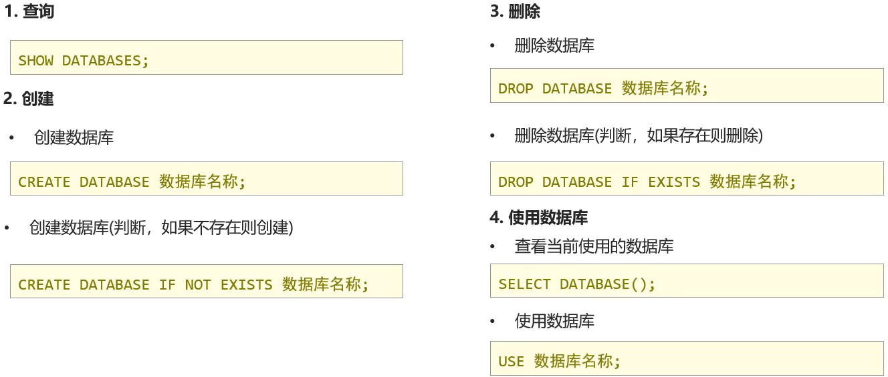
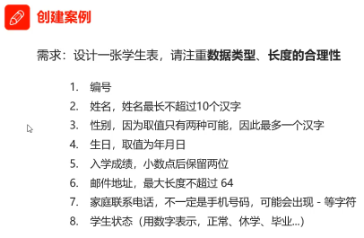

# Java Web 基础

+ 什么是 Web：全球广域网，也称万维网 (www)，能通过浏览器访问的==网站==
+ JavaWeb：是用 Java 技术来解决相关 Web 互联网领域的技术栈

1. 网页：展现数据
2. 数据库：存储和管理数据
3. Java Web程序：逻辑处理

## 1. 数据库

 

数据库 (Data Base)：

+ 存储数据的仓库，数据是有组织的进行存储

数据库管理系统 (Data Base Management System)：

+ 管理数据库的大型软件

SQL (Structured Query Language)：

+ 结构化查询语言
+ 操作关系型数据库的编程语言
+ 定义操作所有关系型数据库的统一标准

**常见的关系型数据库管理系统**

 

+ Oracle：收费的大型数据库，Oracle公司的产品
+ MySQL：开源免费的中小型数据库，后来Sun公司收购了MySQL，而Sun公司又被Oracle收购
+ SQL Sever： Microsoft公司收费的中型的数据库。`C#、.net`等语言常使用
+ PostgreSQL：开源免费中小型的数据库
+ DB2：IBM 公司的大型收费数据库产品
+ SQLite：嵌入式的微型数据库，如作为Android的内置数据库
+ MariaDB：开源免费中小型的数据库

### 1.1 MySQL 安装与使用

[MySQL 安装教程](https://www.runoob.com/mysql/mysql-install.html)

<iframe src="//player.bilibili.com/player.html?aid=379163696&bvid=BV1Qf4y1T7Hx&cid=440652475&page=3" scrolling="no" border="0" frameborder="no" framespacing="0" allowfullscreen="true" height="650px"> </iframe>

### 1.2 MySQL 数据模型

关系型数据库

+ 关系型数据库是建立在关系模型基础上的数据库，关系型数据库是由多张能互相连接的 ==二维表== 组成的数据库

优点：

1. 都是使用表结构，格式一致易于维护
2. 使用通用的 SQL 语言操作，使用方便，可哦用于复杂查询
3. 数据存储在磁盘中，安全

 

### 1.3 SQL

+ 结构化查询语言，一门操作关系型数据库的编程语言
+ 定义操作所有关系型数据库的统一标准
+ 对于同一个需求，每一种数据库操作的方式可能会存在一些不一样的地方，我们称为 "方言"

#### 1.3.1 SQL 通用语法

1. SQL 语句可以当行或多行书写，以分号结尾
2. MySQL 数据库的 SQL 语句不区分大小写，关键字建议使用大写
3. 注释
   + 单行注释：==—— 注释内容== 或 ==# 注释内容（MySQL 特有）==
   + 多行注释：==/* 注释 */==

#### 1.3.2 SQL 分类

+ DDL（Data Denfinition Language）数据定义语言，用来定义数据库对象：数据库，表，列等
+ DML（Data Manipulation Language）数据操作语言，用来对数据库中表的数据进行增删改
+ DQL（Data Query Language）数据查询语言，用来查询数据库中表的（记录）数据
+ DCL（Data Control Language）数据控制语言，用来定义数据库的访问权限和安全级别，及创建用户

 

+ DDL：操作数据库，表等
+ DML：对表中的数据进行增删改
+ DQL：对表中的数据进行查询
+ DCL：对数据库进行权限控制

#### 1.3.3 DDL 操作数据库

1. 查询语句

~~~mysql
show databases;
~~~

示例：

~~~mysql
mysql> show databases;
+--------------------+
| Database           |
+--------------------+
| information_schema | --> 记录mysql库和表，存储的数据是特殊的表->视图（逻辑表）并不存在物理文件
| mysql              | --> 存储mysql的核心信息，如权限、安全等
| performance_schema | --> 存储mysql的性能信息
| sys                | --> 系统相关的信息
+--------------------+
4 rows in set (0.01 sec)
~~~

***

2. 创建语句

~~~mysql
create databases 数据库名;
~~~

示例：

~~~mysql
mysql> create database db1;
Query OK, 1 row affected (0.04 sec)

mysql> show databases;
+--------------------+
| Database           |
+--------------------+
| db1                |
| information_schema |
| mysql              |
| performance_schema |
| sys                |
+--------------------+
5 rows in set (0.00 sec)
~~~

> 同时db1文件夹被创建

 

注意：

+ 当我想要创建同名数据库时，会报错
+ 避免方法，先判断是否存在此数据库，存在则不执行语句，不存在则执行语句

~~~mysql
mysql> create database db1;
ERROR 1007 (HY000): Can't create database 'db1'; database exists

mysql> create database if not exists db1;
Query OK, 1 row affected, 1 warning (0.01 sec)

mysql> create database if not exists db2;
Query OK, 1 row affected (0.04 sec)

mysql> show databases;
+--------------------+
| Database           |
+--------------------+
| db1                |
| db2                |
| information_schema |
| mysql              |
| performance_schema |
| sys                |
+--------------------+
6 rows in set (0.00 sec)
~~~

***

3. 删除

~~~mysql
drop database 数据库名;
~~~

示例：

~~~mysql
mysql> drop database db2;
Query OK, 0 rows affected (0.02 sec)

mysql> show databases;
+--------------------+
| Database           |
+--------------------+
| db1                |
| information_schema |
| mysql              |
| performance_schema |
| sys                |
+--------------------+
5 rows in set (0.00 sec)
~~~

注意：

+ 在删除数据库之前，需要先判断数据库是否存在，否则会报错

~~~mysql
mysql> drop database db2;
ERROR 1008 (HY000): Can't drop database 'db2'; database doesn't exist

mysql> drop database if exists db2;
Query OK, 0 rows affected, 1 warning (0.03 sec)
~~~

***

4. 使用数据库

~~~mysql
use 数据库名;
~~~

示例：

~~~mysql
mysql> use db1;
Database changed

mysql> select database();  # 查看当前使用的数据库
+------------+
| database() |
+------------+
| db1        |
+------------+
1 row in set (0.00 sec)
~~~

***

总结：

#### 1.3.4 DDL 操作表

+ 创建（Create）
+ 查询（Retrieve）
+ 修改（Update）
+ 删除（Delete）

1. 查询表

+ 查询当前数据库下所有表的名称

~~~mysql
SHOW TABLES;

mysql> show tables;
Empty set (0.02 sec)

mysql> use mysql;
Database changed
mysql> show tables;
+------------------------------------------------------+
| Tables_in_mysql                                      |
+------------------------------------------------------+
| columns_priv                                         |
| component                                            |
| db                                                   |
| default_roles                                        |
| engine_cost                                          |
| func                                                 |
| general_log                                          |
| global_grants                                        |
| gtid_executed                                        |
| help_category                                        |
| help_keyword                                         |
| help_relation                                        |
| help_topic                                           |
| innodb_index_stats                                   |
| innodb_table_stats                                   |
| password_history                                     |
| plugin                                               |
| procs_priv                                           |
| proxies_priv                                         |
| replication_asynchronous_connection_failover         |
| replication_asynchronous_connection_failover_managed |
| replication_group_configuration_version              |
| replication_group_member_actions                     |
| role_edges                                           |
| server_cost                                          |
| servers                                              |
| slave_master_info                                    |
| slave_relay_log_info                                 |
| slave_worker_info                                    |
| slow_log                                             |
| tables_priv                                          |
| time_zone                                            |
| time_zone_leap_second                                |
| time_zone_name                                       |
| time_zone_transition                                 |
| time_zone_transition_type                            |
| user                                                 |
+------------------------------------------------------+
37 rows in set (0.01 sec)
~~~

+ 查询表结构

~~~mysql
DESC 表名称;

mysql> desc func;
+-------+------------------------------+------+-----+---------+-------+
| Field | Type                         | Null | Key | Default | Extra |
+-------+------------------------------+------+-----+---------+-------+
| name  | char(64)                     | NO   | PRI |         |       |
| ret   | tinyint                      | NO   |     | 0       |       |
| dl    | char(128)                    | NO   |     |         |       |
| type  | enum('function','aggregate') | NO   |     | NULL    |       |
+-------+------------------------------+------+-----+---------+-------+
4 rows in set (0.01 sec)
~~~

***

2. 创建表

~~~mysql
create table 表名 (
    字段名1 数据类型1,
    字段名2 数据类型2,
    ...
    字段名n 数据类型n
);
~~~

注意：最后一行末尾，==不能加逗号==

 

示例：

~~~mysql
mysql> use db1;
Database changed

mysql> create table tb_user(
    -> id int,
    -> username varchar(20),
    -> password varchar(32)
    -> );
Query OK, 0 rows affected (0.04 sec)

mysql> show tables;
+---------------+
| Tables_in_db1 |
+---------------+
| tb_user       |
+---------------+
1 row in set (0.00 sec)

mysql> desc tb_user;
+----------+-------------+------+-----+---------+-------+
| Field    | Type        | Null | Key | Default | Extra |
+----------+-------------+------+-----+---------+-------+
| id       | int         | YES  |     | NULL    |       |
| username | varchar(20) | YES  |     | NULL    |       |
| password | varchar(32) | YES  |     | NULL    |       |
+----------+-------------+------+-----+---------+-------+
3 rows in set (0.00 sec)
~~~

***

3. 删除表

~~~mysql
drop table 表名;
~~~

+ 删除表时判断表是否存在

~~~mysql
drop table if exists 表名;
~~~

示例：

~~~mysql
mysql> show tables;
+---------------+
| Tables_in_db1 |
+---------------+
| student       |
| tb_user       |
+---------------+
2 rows in set (0.01 sec)

mysql> drop table tb_user;
Query OK, 0 rows affected (0.04 sec)

mysql> show tables;
+---------------+
| Tables_in_db1 |
+---------------+
| student       |
+---------------+
1 row in set (0.00 sec)

mysql> drop table tb_user;
ERROR 1051 (42S02): Unknown table 'db1.tb_user'
mysql> drop table if exists tb_user;
Query OK, 0 rows affected, 1 warning (0.01 sec)
~~~

***

4. 修改表

1. 修改表名

~~~mysql
alter table 表名 rename to 新的表名;

mysql> show tables;
+---------------+
| Tables_in_db1 |
+---------------+
| student       |
+---------------+
1 row in set (0.01 sec)

mysql> alter table student rename to stu;
Query OK, 0 rows affected (0.06 sec)

mysql> show tables;
+---------------+
| Tables_in_db1 |
+---------------+
| stu           |
+---------------+
1 row in set (0.01 sec)
~~~

2. 添加一列

~~~mysql
alter table 表名 add 列名 数据类型;

mysql> desc stu;
+----------+-------------+------+-----+---------+-------+
| Field    | Type        | Null | Key | Default | Extra |
+----------+-------------+------+-----+---------+-------+
| id       | int         | YES  |     | NULL    |       |
| name     | varchar(10) | YES  |     | NULL    |       |
| gender   | char(1)     | YES  |     | NULL    |       |
| birthday | date        | YES  |     | NULL    |       |
| score    | double(5,2) | YES  |     | NULL    |       |
| email    | varchar(64) | YES  |     | NULL    |       |
| tel      | varchar(15) | YES  |     | NULL    |       |
| status   | tinyint     | YES  |     | NULL    |       |
+----------+-------------+------+-----+---------+-------+
8 rows in set (0.01 sec)

mysql> # 添加一个地址列
mysql> alter table stu add address varchar(50);
Query OK, 0 rows affected (0.06 sec)
Records: 0  Duplicates: 0  Warnings: 0

mysql> desc stu;
+----------+-------------+------+-----+---------+-------+
| Field    | Type        | Null | Key | Default | Extra |
+----------+-------------+------+-----+---------+-------+
| id       | int         | YES  |     | NULL    |       |
| name     | varchar(10) | YES  |     | NULL    |       |
| gender   | char(1)     | YES  |     | NULL    |       |
| birthday | date        | YES  |     | NULL    |       |
| score    | double(5,2) | YES  |     | NULL    |       |
| email    | varchar(64) | YES  |     | NULL    |       |
| tel      | varchar(15) | YES  |     | NULL    |       |
| status   | tinyint     | YES  |     | NULL    |       |
| address  | varchar(50) | YES  |     | NULL    |       |
+----------+-------------+------+-----+---------+-------+
9 rows in set (0.01 sec)
~~~

3. 修改数据类型

~~~mysql
alter table 表名 modify 列名 新数据类型;

mysql> desc stu;
+----------+-------------+------+-----+---------+-------+
| Field    | Type        | Null | Key | Default | Extra |
+----------+-------------+------+-----+---------+-------+
| id       | int         | YES  |     | NULL    |       |
| name     | varchar(10) | YES  |     | NULL    |       |
| gender   | char(1)     | YES  |     | NULL    |       |
| birthday | date        | YES  |     | NULL    |       |
| score    | double(5,2) | YES  |     | NULL    |       |
| email    | varchar(64) | YES  |     | NULL    |       |
| tel      | varchar(15) | YES  |     | NULL    |       |
| status   | tinyint     | YES  |     | NULL    |       |
| address  | varchar(50) | YES  |     | NULL    |       |
+----------+-------------+------+-----+---------+-------+
9 rows in set (0.01 sec)

mysql> # 把列名改成char(50)
mysql> alter table stu modify address char(50);
Query OK, 0 rows affected (0.09 sec)
Records: 0  Duplicates: 0  Warnings: 0

mysql> desc stu;
+----------+-------------+------+-----+---------+-------+
| Field    | Type        | Null | Key | Default | Extra |
+----------+-------------+------+-----+---------+-------+
| id       | int         | YES  |     | NULL    |       |
| name     | varchar(10) | YES  |     | NULL    |       |
| gender   | char(1)     | YES  |     | NULL    |       |
| birthday | date        | YES  |     | NULL    |       |
| score    | double(5,2) | YES  |     | NULL    |       |
| email    | varchar(64) | YES  |     | NULL    |       |
| tel      | varchar(15) | YES  |     | NULL    |       |
| status   | tinyint     | YES  |     | NULL    |       |
| address  | char(50)    | YES  |     | NULL    |       |
+----------+-------------+------+-----+---------+-------+
9 rows in set (0.00 sec)
~~~

4. 修改列名和数据类型

~~~mysql
alter table 表名 change 列名 新列名 新的数据类型;

mysql> desc stu;
+----------+-------------+------+-----+---------+-------+
| Field    | Type        | Null | Key | Default | Extra |
+----------+-------------+------+-----+---------+-------+
| id       | int         | YES  |     | NULL    |       |
| name     | varchar(10) | YES  |     | NULL    |       |
| gender   | char(1)     | YES  |     | NULL    |       |
| birthday | date        | YES  |     | NULL    |       |
| score    | double(5,2) | YES  |     | NULL    |       |
| email    | varchar(64) | YES  |     | NULL    |       |
| tel      | varchar(15) | YES  |     | NULL    |       |
| status   | tinyint     | YES  |     | NULL    |       |
| address  | char(50)    | YES  |     | NULL    |       |
+----------+-------------+------+-----+---------+-------+
9 rows in set (0.00 sec)

mysql> alter table stu change address addr varchar(30);
Query OK, 0 rows affected (0.08 sec)
Records: 0  Duplicates: 0  Warnings: 0

mysql> desc stu;
+----------+-------------+------+-----+---------+-------+
| Field    | Type        | Null | Key | Default | Extra |
+----------+-------------+------+-----+---------+-------+
| id       | int         | YES  |     | NULL    |       |
| name     | varchar(10) | YES  |     | NULL    |       |
| gender   | char(1)     | YES  |     | NULL    |       |
| birthday | date        | YES  |     | NULL    |       |
| score    | double(5,2) | YES  |     | NULL    |       |
| email    | varchar(64) | YES  |     | NULL    |       |
| tel      | varchar(15) | YES  |     | NULL    |       |
| status   | tinyint     | YES  |     | NULL    |       |
| addr     | varchar(30) | YES  |     | NULL    |       |
+----------+-------------+------+-----+---------+-------+
9 rows in set (0.00 sec)
~~~

5. 删除列

~~~mysql
alter table 表名 drop 列名;

mysql> desc stu;
+----------+-------------+------+-----+---------+-------+
| Field    | Type        | Null | Key | Default | Extra |
+----------+-------------+------+-----+---------+-------+
| id       | int         | YES  |     | NULL    |       |
| name     | varchar(10) | YES  |     | NULL    |       |
| gender   | char(1)     | YES  |     | NULL    |       |
| birthday | date        | YES  |     | NULL    |       |
| score    | double(5,2) | YES  |     | NULL    |       |
| email    | varchar(64) | YES  |     | NULL    |       |
| tel      | varchar(15) | YES  |     | NULL    |       |
| status   | tinyint     | YES  |     | NULL    |       |
| addr     | varchar(30) | YES  |     | NULL    |       |
+----------+-------------+------+-----+---------+-------+
9 rows in set (0.00 sec)

mysql> alter table stu drop addr;
Query OK, 0 rows affected (0.06 sec)
Records: 0  Duplicates: 0  Warnings: 0

mysql> desc stu;
+----------+-------------+------+-----+---------+-------+
| Field    | Type        | Null | Key | Default | Extra |
+----------+-------------+------+-----+---------+-------+
| id       | int         | YES  |     | NULL    |       |
| name     | varchar(10) | YES  |     | NULL    |       |
| gender   | char(1)     | YES  |     | NULL    |       |
| birthday | date        | YES  |     | NULL    |       |
| score    | double(5,2) | YES  |     | NULL    |       |
| email    | varchar(64) | YES  |     | NULL    |       |
| tel      | varchar(15) | YES  |     | NULL    |       |
| status   | tinyint     | YES  |     | NULL    |       |
+----------+-------------+------+-----+---------+-------+
8 rows in set (0.00 sec)
~~~

 

##### 1. 数据类型

+ MySQL 支持多种类型，可以分为三类：
  + 数值
  + 日期
  + 字符串

 

特殊的：

double在设置字段的数值类型时：

~~~mysql
score double(总长度, 小数点后保留的位数)
例如：
score double(5, 2) 假设分数的范围是0~100
100.00，这里的总长度就是5，小数点前+小数点后
~~~

***

字符串类型设置时：

~~~mysql
char(20)
varchar(20)
....(XX)

括号里的数字就是限制字段的长度

注意 char和varchar 的区别
1. char存储性能高，varchar存储性能低
2. char是定长字符串，不够用的地方用空格补齐
3. varchar是变长字符串，会计算当前字符长度来分配空间
~~~

##### 案例练习：

 

示例：

~~~mysql
mysql> show databases;
+--------------------+
| Database           |
+--------------------+
| db1                |
| information_schema |
| mysql              |
| performance_schema |
| sys                |
+--------------------+
5 rows in set (0.01 sec)

mysql> use db1;
Database changed
mysql> desc tb_user;
+----------+-------------+------+-----+---------+-------+
| Field    | Type        | Null | Key | Default | Extra |
+----------+-------------+------+-----+---------+-------+
| id       | int         | YES  |     | NULL    |       |
| username | varchar(20) | YES  |     | NULL    |       |
| password | varchar(32) | YES  |     | NULL    |       |
+----------+-------------+------+-----+---------+-------+

mysql> create table student(
    ->
    ->     id int,
    ->     name varchar(10),
    ->     gender char(1),
    ->     birthday date,
    ->     score double(5,2),
    ->     email varchar(64),
    ->     tel varchar(15),
    ->     status tinyint
    -> );
Query OK, 0 rows affected, 1 warning (0.06 sec)

mysql> desc student;
+----------+-------------+------+-----+---------+-------+
| Field    | Type        | Null | Key | Default | Extra |
+----------+-------------+------+-----+---------+-------+
| id       | int         | YES  |     | NULL    |       |
| name     | varchar(10) | YES  |     | NULL    |       |
| gender   | char(1)     | YES  |     | NULL    |       |
| birthday | date        | YES  |     | NULL    |       |
| score    | double(5,2) | YES  |     | NULL    |       |
| email    | varchar(64) | YES  |     | NULL    |       |
| tel      | varchar(15) | YES  |     | NULL    |       |
| status   | tinyint     | YES  |     | NULL    |       |
+----------+-------------+------+-----+---------+-------+
8 rows in set (0.01 sec)
~~~

#### 1.3.5 DML 操作表中数据

1. 添加数据

+ 给指定列添加数据

~~~mysql
insert into 表名(列名1, 列名2, ...) values(值1, 值2);

insert into stu(id, name) values (1, 'pine');
~~~

 

+ 给全部列添加数据

~~~mysql
insert into 表名 values(值1, 值2);

-- 给所有列添加数据，不建议省略列名
INSERT INTO stu ( id, NAME, gender, birthday, score, email, tel, `status` )
VALUES
	( 2, 'Mikey', '男', '1999-11-11', 88.88, '123@gmail.com', '1234567890', '1' );
~~~

+ 批量添加数据

~~~mysql
insert into 表名(列名1, 列名2, ...) values(值1, 值2, ...),(值1, 值2, ...)...;
insert into 表名 values(值1, 值2, ...),(值1, 值2, ...),(值1, 值2, ...)...;

-- 批量添加数据
INSERT INTO stu
VALUES
	( 2, 'Mikey', '男', '1999-11-11', 88.88, '123@gmail.com', '1234567890', '1' )(
		2,
		'Mikey',
		'男',
		'1999-11-11',
		88.88,
		'123@gmail.com',
		'1234567890',
		'1' 
		)(
		2,
		'Mikey',
		'男',
		'1999-11-11',
		88.88,
		'123@gmail.com',
		'1234567890',
	'1' 
	);
~~~

 

***

2. 修改数据

1. 修改表数据

~~~mysql
update 表名 set 列名=值1,列名2=值2,.....[where 条件];

	-- 修改数据 update 表名 set 列名1=值1,列名2=值2... [where 条件];
	-- 将Mikey的性别改为女
	update stu set gender='女' where name='Mikey';
~~~

 

~~~mysql
	-- 将pine的生日改为1999-12-12 分数改为99.99
	update stu set birthday='1999-12-12',score=99.99 where name='pine';
~~~

 

***

 

> 注意：修改语句中如果不加条件，则==将所有数据都修改==

***

3. 删除数据

+ 删除数据

~~~mysql
delete from 表名 [where 条件];

	-- 删除pine
	delete from stu where name='pine';
~~~

 

***

 

> 注意：修改语句中如果不加条件，则==将所有数据都修改==

#### 1.3.6 DQL 查询表中数据

查询语法：

~~~mysql
select
    字段列表
from
    表名列表
where
    条件列表
group by
    分组字段
having
    分组后条件
order by
    排序字段
limit
    分页限定
~~~

##### 1. 基础查询-SELECT

+ 查询多个字段

~~~mysql
select 字段列表 from 表名;
select * from 表名; -- 查询所有数据

-- 基础查询 ===========
-- 查询 name age 这两列
select name,age from stu;

-- 查询所有列的数据，列名的列表可以使用*代替，但是不建议使用
select * from stu;

-- 查询地址信息，看同学都来自哪一个城市
select address from stu;

-- 查询姓名，数学和英语成绩
select name,math,english from stu;
select name,math as 数学成绩,english as 英语成绩 from stu;
~~~

 

 

+ 去除重复记录

~~~mysql
select distinct 字段列表 from 表名;

select distinct address from stu;  --去重
~~~

  

+ 起别名

~~~mysql
as: -- as也可以省略

select name,math,english from stu;
select name,math as 数学成绩,english as 英语成绩 from stu;
~~~

 

##### 2. 条件查询-WHERE

+ 条件查询语法

~~~mysql
select 字段列表 from 表名 where 条件列表
~~~

条件：

| 操作符           | 描述                                                         |
| ---------------- | ------------------------------------------------------------ |
| =                | 等于                                                         |
| <> 或 !=         | 不等于                                                       |
| >                | 大于                                                         |
| <                | 小于                                                         |
| >=               | 大于等于                                                     |
| <=               | 小于等于                                                     |
| BETWEEN...AND... | 在某个范围内（都包含）                                       |
| LIKE 占位符      | 搜索某种模式，模糊查询 ==“_单个任意字符”==  ==“%多个任意字符”== |
| IN(...)          | 多选一                                                       |
| IS NULL          | 是NULL                                                       |
| AND 或 &&        | 并且                                                         |
| OR 或 \|\|       | 或者                                                         |

示例：

~~~mysql
select * from stu;

-- 条件查询
-- 1.查询年龄大于20岁的学员信息
select * from stu where age > 20;
~~~

 

***

~~~mysql
-- 查询年龄大于等于20岁的学员信息
select * from stu where age >= 20;
~~~

 

***

~~~mysql
-- 查询 大于等于20岁 并且 年龄 小于等于30岁 的学员信息
select * from stu where age >= 20 and age <= 30;
select * from stu where age between 20 and 30;
~~~

 

***

~~~mysql
-- 查询入学日期在 '1998-09-01' 到 '1999-09-01'之间的学员信息
select * from stu where hire_date between'1998-09-1' and '1999-09-01';
~~~

 

***

~~~mysql
-- 查询年龄等于18岁的学员信息
select * from stu where age=18;
~~~

 

***

~~~mysql
-- 查询年龄不等于18岁的学员信息
select * from stu where age!=18;
select * from stu where age<>18;
~~~

 

***

~~~mysql
-- 查询年龄等于18岁或者年龄等于20岁或者年龄等于22岁的学员信息
select * from stu where age=18 or age=20 or age=22;
select * from stu where age in(18,20,22);
~~~

 

***

~~~mysql
-- 查询英语成绩为null的学员信息
-- 注意：NULL值的比较不能使用 = , !=比较，需要使用 is / is not比较
select * from stu where english=NULL; -- 错误的，查不到信息
select * from stu where english is NULL;
select * from stu where english is not NULL;
~~~

 

 

 

***

~~~mysql
-- 模糊查询 like ==========
/*
   通配符：
	 1. _: 代表单个任意字符
	 2. %: 代表任意个数字符
*/

-- 1. 查询姓'马'的学员信息
select * from stu where name like '马%';

-- 2. 查询第二个字是'花'的学员信息
select * from stu where name like '_化%';

-- 3. 查询名字中包含'德'的学员信息
select * from stu where name like '%德%';
~~~

 

 

 

***

##### 3. 排序查询-ORDER BY

1. 排序查询语法

~~~mysql
select 字段列表 from 表名 order by 排序字段名1 [排序方式1],排序字段名2 [排序方式2] ...;
~~~

排序方式：

+ ASC：升序排列（默认值）
+ DESC：降序排列

注意：如果有多个排序条件，当前边的条件值一样时，才会根据第二条件进行排序

~~~mysql
/*
   排序查询：
	    语法：select 字段列表 from 表名 order by 排序字段名1 [排序方式1],排序字段名2 [排序方式2] ...;
			排序方式：
			    ASC：升序排列（默认值）
					DESC：降序排列
*/

-- 1.查询学生信息，安装年龄升序排列
select * from stu order by age ASC;
select * from stu order by age;
~~~

 

***

~~~mysql
-- 2. 查询学生信息，按照数学成绩降序排列
select * from stu order by math DESC;
~~~

 

***

~~~mysql
-- 3. 查询学生信息，按照数学成绩降序排列，如果数学成绩一样，再按照英语成绩升序排列
select * from stu order by math DESC,english ASC;
~~~

 

> 注意：如果有多个排序条件，当前边的条件值一样时，才会根据第二条件进行排序

***

##### 4. 分组查询-GROUP BY

聚合函数

1. 概念：将一列数据作为一个整体，进行纵向计算
2. 聚合函数的分类：

| 函数名     | 功能                             |
| ---------- | -------------------------------- |
| cout(列名) | 统计数量（一般选用不为NULL的列） |
| max(列名)  | 最大值                           |
| min(列名)  | 最小值                           |
| sum(列名)  | 求和                             |
| avg(列名)  | 平均值                           |

3. 聚合函数语法：

~~~mysql
select 聚合函数名(列名) from 表;
~~~

注意：NULL 值不参与所有聚合函数的运算

~~~mysql
/*
sum():求和，且求和的列值必须为number数据类型
count()：统计记录记录数，且不能为空
   1. 主键：非空且唯一
	 2. *
max()：求一组值中的最大值，列值的类型可以为数据类型也可以为字符类型
min()：求一组值中的最小值，列值的类型可以为数据类型也可以为字符类型
avg()：求平均值，且求平均值的列值必须为number数据类型
*/

-- 1. 统计班级一共有多少个学生
select count(id) from stu;  -- 8
select count(english) from stu; -- 7
~~~

 

***

~~~mysql
-- 2. 查询数学成绩的最高分
select max(math) from stu;
~~~

 

***

~~~mysql
-- 3. 查询数学成绩的最低分
select min(math) from stu;
~~~

 

***

~~~mysql
-- 4. 查询数学成绩的总分
select sum(math) from stu;
~~~

 

***

~~~mysql
-- 5. 查询数学成绩的平均分
select avg(math) from stu;
~~~

 

***

~~~mysql
-- 6. 查询英语成绩的最低分
select min(english) from stu;
~~~

 

***

1. 分组查询语法

~~~mysql
select 字段列表 from 表名 [Where 分组条件前限定] group by 分组字段名 [Having 分组后条件过滤];
~~~

注意：分组之后，查询的字段为聚合函数和分组字段，查询其他字段无任何意义

~~~mysql
/*
    分组函数
		    select 字段列表 from 表名 [where 分组前条件限定] group by分组字段名 [having 分组后条件过滤]
*/

-- 1. 查询男同学和女同学各自的数学平均分
select sex,avg(math) from stu group by sex;
~~~

 

***

~~~mysql
-- 2. 查询男同学和女同学各自的数学平均分以及各自人数
select sex,avg(math),count(*) from stu group by sex;
~~~

 

***

~~~mysql
-- 3. 查询男同学和女同学各自的数学平均分以及各自人数要求分数低于70分以下的不参与分组
select sex,avg(math),count(*) from stu where math>=70 group by sex;
~~~

 

***

~~~mysql
-- 4. 查询男同学和女同学各自的数学平均分以及各自人数要求分数低于70分以下的不参与分组,分组之后人数大于2 
select sex,avg(math),count(*) from stu where math>=70 group by sex having count(*)>2;
~~~

 

***

where 和 having 区别：

+ 执行时机不一样：where 是分组之前进行限定，不满足 where 条件，则不参与分组，而 having 是分组之后对结果进行过滤
+ 可判断条件不一样：where 不能对聚合函数进行判断，having 可以

执行顺序：where > 聚合函数 > having

##### 5. 分页查询-LIMIT

1. 分页查询语法

~~~mysql
select 字段列表 from 表名 LIMIT 起始索引,查询条目数;
~~~

+ 起始索引：从0开始

计算公式：起始索引 = (当前页码-1) * 每页显示的条数

注意：

1. 分页查询 LIMIT 是 MySQL 数据库的特有语言
2. Oracle 分页查询使用 rownumber
3. SQL Server 分页查询使用 top

示例：

~~~mysql
/*
    Select 字段列表 From 表名 Limit 起始索引,查询条目数
        起始索引：从0开始
*/

select * from stu;
-- 1. 从0开始查询，查询3条数据
select * from stu limit 0,3;

-- 2. 每页显示3条数据，查询第一页数据
select * from stu limit 0,3;

-- 3. 每页显示3条数据查询第2页数据
select * from stu limit 3,3;

-- 4. 每页显示3条数据查询第3页数据
select * from stu limit 6,3

-- 起始索引 = (当前页码-1) * 每页显示的条目数
~~~

 

总结：

<iframe src="//player.bilibili.com/player.html?aid=379163696&bvid=BV1Qf4y1T7Hx&cid=440652729&page=18" scrolling="no" border="0" frameborder="no" framespacing="0" allowfullscreen="true" height="650px"> </iframe>

### 1.4 图形化客户端工具

Navicat

+ Navicat for MySQL 是管理和开发 MySQL 或 MariaDB 的理想解决方案
+ 这套全面的前端工具为数据库管理、开发和维护提供了一款直观而强大的图形界面

[Navicat 官方网站](https://www.navicat.com.cn)

### 1.5 约束

<iframe src="//player.bilibili.com/player.html?aid=379163696&bvid=BV1Qf4y1T7Hx&cid=440652753&page=19" scrolling="no" border="0" frameborder="no" framespacing="0" allowfullscreen="true" height="650px"> </iframe>

1. 约束的概念
   + 约束是作用于表中列上的规则，用于限制加入表的数据
   + 约束的存在保证了数据库中数据的正确性、有效性和完整性
2. 约束的分类

| 约束名称 | 描述                                                         | 关键字      |
| -------- | ------------------------------------------------------------ | ----------- |
| 非空约束 | 保证列中所有数据不能有NULL值                                 | NOT NULL    |
| 唯一约束 | 保证列中所有数据各不相同                                     | UNIQUE      |
| 主键约束 | 主键是一行数据的唯一标识，要求非空且唯一                     | PRIMARY KEY |
| 检查约束 | 保证列中的值满足某一条件                                     | CHECK       |
| 默认约束 | 保存数据时，未指定值则采用默认值                             | DEFAULT     |
| 外键约束 | 外键用来让两个表的数据之间建立链接，保证数据的一致性和完整性 | FOREIGN KEY |

Tips：MySQL 不支持检查约束

自动增长：

~~~mysql
-- 演示自动增长 auto_increment：当列是数字类型且是唯一约束
INSERT INTO emp ( ename, joindate, salary, bonus )
VALUES
	( '赵六', '1999-11-11', 8800, NULL );

INSERT INTO emp ( id, ename, joindate, salary, bonus )
VALUES
	( null, '赵六2', '1999-11-11', 8800, NULL );
~~~

 

#### 1. 非空约束

概念：

+ 非空约束用于保证列中所有数据不能有 NULL 值

语法：

1. 添加约束

~~~mysql
-- 创建表时添加非空约束
creat table 表名 (
   列名 数据类型 NOT NULL,
   ... 
);
~~~

~~~mysql
-- 建完表后添加非空约束
alter table 表名 modify 字段名 数据类型 not null;
~~~

2. 删除约束

~~~mysql
alter table 表名 modify 字段名 数据类型;
~~~

示例：

~~~mysql
DROP TABLE
IF
	EXISTS emp;-- 员工表
CREATE TABLE emp (
	id INT PRIMARY KEY auto_increment,-- 员工id，主键且自增长
	ename VARCHAR ( 50 ) NOT NULL UNIQUE,-- 员工姓名，非空且唯一
	joindate date NOT NULL,-- 入职日期，非空
	salary DOUBLE ( 7, 2 ) NOT NULL,-- 工资，非空
	bonus DOUBLE ( 7, 2 ) DEFAULT 0 -- 奖金，如果没有奖金默认为0
	
);

INSERT INTO emp ( id, ename, joindate, salary, bonus )
VALUES
	( 1, '张三', '1999-11-11', 8800, 5000 );

INSERT INTO emp ( id, ename, joindate, salary, bonus )
VALUES
	( 2, '李四', '1999-11-11', 8800, 5000 );

-- 演示非空约束
INSERT INTO emp ( id, ename, joindate, salary, bonus )
VALUES
	( 2, '李四', '1999-11-11', 8800, 5000 );
~~~

 

#### 2. 唯一约束

概念：

+ 唯一约束用于保证列中所有数据各不相同

语法：

1. 添加约束

~~~mysql
-- 创建表时添加唯一约束
creat table 表名 (
    列名 数据类型 unique [auto_increment],
    -- auto_increment：当不指定值时自动增长
   ... 
);

creat table 表名 (
   列名 数据类型,
   ...
   [constraint][约束名称] unique(列名)
);
~~~

~~~mysql
-- 建完表后添加唯一约束
alter table 表名 modify 字段名 数据类型 unique;
~~~

2. 删除约束

~~~mysql
alter table 表名 drop index 字段名
~~~

示例：

~~~mysql
DROP TABLE
IF
	EXISTS emp;-- 员工表
CREATE TABLE emp (
	id INT PRIMARY KEY auto_increment,-- 员工id，主键且自增长
	ename VARCHAR ( 50 ) NOT NULL UNIQUE,-- 员工姓名，非空且唯一
	joindate date NOT NULL,-- 入职日期，非空
	salary DOUBLE ( 7, 2 ) NOT NULL,-- 工资，非空
	bonus DOUBLE ( 7, 2 ) DEFAULT 0 -- 奖金，如果没有奖金默认为0
	
);

INSERT INTO emp ( id, ename, joindate, salary, bonus )
VALUES
	( 1, '张三', '1999-11-11', 8800, 5000 );

INSERT INTO emp ( id, ename, joindate, salary, bonus )
VALUES
	( 2, '李四', '1999-11-11', 8800, 5000 );

-- 演示唯一约束
INSERT INTO emp ( id, ename, joindate, salary, bonus )
VALUES
	( 3, '李四', '1999-11-11', 8800, 5000 );
~~~

 

#### 3. 主键约束

1. 概念：
   + 主键是一行数据的唯一标识，要求非空且唯一
   + 一张表只能有一个主键
2. 语法：
   1. 添加约束

~~~mysql
-- 创建表时添加主键约束
creat table 表名 (
   列名 数据类型 primary key [auto_increment],
   ... 
);

creat table 表名 (
   列名 数据类型,
   ...
   [constraint][约束名称] primary key(列名)
);
~~~

~~~mysql
-- 建完表后添加主键约束
alter table 表名 add primary key(字段名);
~~~

2. 删除约束

~~~Mysql
alter table 表名 drop primary key;
~~~

示例：

~~~mysql
DROP TABLE
IF
	EXISTS emp;-- 员工表
CREATE TABLE emp (
	id INT PRIMARY KEY,-- 员工id，主键且自增长
	ename VARCHAR ( 50 ) NOT NULL UNIQUE,-- 员工姓名，非空且唯一
	joindate date NOT NULL,-- 入职日期，非空
	salary DOUBLE ( 7, 2 ) NOT NULL,-- 工资，非空
	bonus DOUBLE ( 7, 2 ) DEFAULT 0 -- 奖金，如果没有奖金默认为0
	
);

select * from emp;

INSERT INTO emp ( id, ename, joindate, salary, bonus )
VALUES
	( 1, '张三', '1999-11-11', 8800, 5000 );

-- 演示主键约束，要求唯一且非空
INSERT INTO emp ( id, ename, joindate, salary, bonus )
VALUES
	( NULL, '张三', '1999-11-11', 8800, 5000 );

INSERT INTO emp ( id, ename, joindate, salary, bonus )
VALUES
	( 1, '张三', '1999-11-11', 8800, 5000 );

INSERT INTO emp ( id, ename, joindate, salary, bonus )
VALUES
	( 2, '李四', '1999-11-11', 8800, 5000 );
~~~

 

#### 4. 默认约束

概念：

+ 保存数据时，未指定值采用默认值

语法：

1. 添加约束

~~~mysql
-- 创建表时添加默认约束
create table 表名(
    列名 数据类型 default 默认值,
    ...
);
~~~

~~~mysql
-- 建完表后添加默认约束
alter table 表名 alter 列名 set default 默认值
~~~

2. 删除约束

~~~mysql
alter table 表名 alter 列名 drop default;
~~~

示例：

~~~mysql
DROP TABLE
IF
	EXISTS emp;-- 员工表
CREATE TABLE emp (
	id INT PRIMARY KEY auto_increment,-- 员工id，主键且自增长
	ename VARCHAR ( 50 ) NOT NULL UNIQUE,-- 员工姓名，非空且唯一
	joindate date NOT NULL,-- 入职日期，非空
	salary DOUBLE ( 7, 2 ) NOT NULL,-- 工资，非空
	bonus DOUBLE ( 7, 2 ) DEFAULT 0 -- 奖金，如果没有奖金默认为0
	
);

INSERT INTO emp ( id, ename, joindate, salary, bonus )
VALUES
	( 1, '张三', '1999-11-11', 8800, 5000 );

INSERT INTO emp ( id, ename, joindate, salary, bonus )
VALUES
	( 2, '李四', '1999-11-11', 8800, 5000 );

-- 演示默认约束
INSERT INTO emp ( id, ename, joindate, salary )
VALUES
	( 3, '王五', '1999-11-11', 8800 );

INSERT INTO emp ( id, ename, joindate, salary, bonus )
VALUES
	( 4, '赵六', '1999-11-11', 8800, NULL );
~~~

 

#### 5. 外键约束

<iframe src="//player.bilibili.com/player.html?aid=379163696&bvid=BV1Qf4y1T7Hx&cid=440652780&page=21" scrolling="no" border="0" frameborder="no" framespacing="0" allowfullscreen="true" height="650px"> </iframe>

概念：

+ 外键用来让连个表的数据之间建立链接，保证数据的一致性和完整性

语法：

1. 添加约束

~~~mysql
-- 创建表时添加外键约束
create table 表名(
   列名 数据类型,
   ...
   [constraint] [外键名称] foreign key(外键列名) references 主表(主表列名)
);
~~~

~~~mysql
-- 建完表后添加外键约束
alter table 表名 add constraint 外键名称 foreign key (外键字段名称) references 主表名称(主表列名称)
~~~

2. 删除约束

~~~mysql
alter table 表名 drop foreign key 外键名称;
~~~

示例：

~~~mysql
-- 删除表
drop table if exists emp;
drop table if exists dept;

-- 部门表
create table dept(
  id int primary key auto_increment,
	dep_name varchar(20),
	addr varchar(20)
);

-- 员工表
create table emp(
  id int primary key auto_increment,
	name varchar(20),
	age int,
	dep_id int,
	
	-- 添加外键 dep_id,关联dept表的id主键
	constraint fk_emp_dept foreign key(dep_id) references dept(id)
);

-- 添加2个部门
insert into dept(dep_name,addr) VALUES
('研发部','广州'),('销售部','深圳');

-- 添加员工,dep_id 表示员工所在的部门
insert into emp(`NAME`,age,dep_id) VALUES
('张三',20,1),
('李四',20,1),
('王五',20,1),
('赵六',20,2),
('孙七',22,2),
('周八',18,2);

-------------------
select * from emp;

-- 删除外键
alter table emp drop foreign key fk_emp_dept;

-- 建完表后，添加外键
alter table emp add constraint fk_emp_dept foreign key(dep_id) references dept(id)

-- 查另一张表
select * from dept;
~~~

 

试图删除主表的某列数据：

 

### 1.6 数据库设计

1. 软件的研发步骤

~~~mermaid
graph LR
    A(需求分析) --> B(设计) --> C(编码) --> D(测试) --> E(安装部署)
~~~

2. 数据库设计概念

+ 数据库设计就是根据业务系统的具体需求，结合我们所选用的DBMS，为这个业务系统构造出最优的数据存储模型

+ 建立数据库中的表结构以及表与表之间的关联关系的过程

+ 有哪些表？表里有哪些字段？表和表之间有什么关系？

3. 数据库设计的步骤

   1. 需求分析（数据是什么？数据具有哪些属性？数据与属性的特点是什么？）

   2. 逻辑分析（通过ER图对数据库进行逻辑建模，不需要我们考虑所选用的数据库管理系统）

   3. 物理设计（根据数据库自身的特点，把逻辑设计转换为物理设计

   4. 维护设计（1.对新的需求进行建表; 2.表优化）

表关系

+ 一对一：

  如：用户 和 用户详情

  一对一关系多用于表拆分，将一个实体中经常使用的字段放一张表，不经常使用的字段放另外一张表，用于提升查询性能 

+ 一对多（多对一）：

  如：部门 和 员工

  一个部门对应多个员工，一个员工对应一个部门

+ 多对多：

  如：商品 和 订单

  一个商品对应多个订单，一个订单包含多个商品

#### 1. 表关系之一对多

一对多（多对一）

如：部门表 和 员工表

一个部门对应多个员工，一个员工对应一个部门

实现方式：在多的一方建立外键，指向一的一方的主键

#### 2. 表关系之多对多

多对多：

如：商品 和 订单

一个商品对应多个订单，一个订单包含多个商品

实现方式：建立第三张中间表，中间表至少包含两个外键，分别关联两方主键

示例：

~~~Mysql
/*多对多：
    如：商品 和 订单
    一个商品对应多个订单，一个订单包含多个商品
    实现方式：建立第三张中间表，中间表至少包含两个外键，分别关联两方主键
*/

-- 删除表 
drop table if exists tb_order_goods;
drop table if exists tb_order;
drop table if exists tb_goods;

-- 订单表
create table tb_order(
  id int primary key auto_increment,
	payment double(10, 2),
	payment_type tinyint,
	status tinyint
);

-- 商品表
create table tb_goods(
  id int primary key auto_increment,
	title varchar(100),
	price double(10,2)
);

-- 订单商品中间表
create table tb_order_goods(
  id int primary key auto_increment,
  order_id int,
	goods_id int,
	count int
);

-- 建完表后，添加外键
alter table tb_order_goods add constraint fk_order_id foreign key(order_id) references tb_order(id);
alter table tb_order_goods add constraint fk_goods_id foreign key(goods_id) references tb_goods(id);
~~~

 

#### 3. 表关系之一对一

一对一：

如：用户 和 用户详情

一对一关系多用于表拆分，将一个实体中经常使用的字段放一张表，不经常使用的字段放另外一张表，用于提升查询性能

实现方式：在任意一方加入外键，关联另一方主键，并且设置外键为==唯一(UNIQUE)==

 

#### 4. 总结

+ 一对多实现方式
  + 在多的一方建立外键关联一的一方主键

+ 多对多实现方式
  + 建立第三张中间表
  + 中间表至少包含2个外键，分别关联双方主键

+ 一对一实现方式
  + 在任意一方建立外键，关联对方主键，并且设置外键唯一

### 1.7 数据库设计案例

<iframe src="//player.bilibili.com/player.html?aid=379163696&bvid=BV1Qf4y1T7Hx&cid=440652806&page=24" scrolling="no" border="0" frameborder="no" framespacing="0" allowfullscreen="true" height="650px"> </iframe>

### 1.8 多表查询

+ 笛卡尔积：取A,B集合所有组合情况
+ 多表查询：从多张表查询数据
  + 连接查询
    + 内连接：相当于查询A B交集数据
    + 外连接：
      1. 左外连接：相当于查询A表所有数据的交集部分数据
      2. 右外连接：相当于查询B表所有数据的交集部分数据
  + 子查询

 

#### 1. 内连接

+ 内连接查询语法

~~~mysql
-- 隐式内链接
select 字段列表 from 表1,表2... where 条件;

-- 显式内连接
select 字段列表 from 表1 [insert] join 表2 on 条件;
~~~

内连接相当于查询A B交集数据

 

示例：

~~~mysql
drop table if exists emp;
drop table if exists dept;

# 创建部门表
create table dept(
   did int primary key auto_increment,
	 dname varchar(20)
);

# 创建员工表
create table emp(
   id int primary key auto_increment, 
	 name varchar(10),
	 gender char(1),
	 salary double, -- 工资
	 join_date date, -- 入职日期
	 dep_id int,
	 foreign key (dep_id) references dept(did) -- 外键，关联部门表（部门表的主键）
);

-- 添加部门的数据
insert into dept (dname) values ('研发部'),('市场部'),('财务部'),('销售部');

-- 添加员工数据
insert into emp (name,gender,salary,join_date,dep_id) VALUES
('孙悟空','男',7200,'2013-02-24',1),
('猪八戒','男',3600,'2010-12-02',2),
('唐僧','男',9000,'2008-08-08',2),
('白骨精','女',5000,'2015-10-07',3),
('蜘蛛精','女',4500,'2011-03-14',1),
('小白龙','男',2500,'2011-02-14',null);

select * from dept;
select * from emp;

-- 多表查询
select * from emp,dept;

-- 笛卡尔积：有A,B两个集合 取A,B所有的组合情况

-- 需要消除无效数据

-- 怎么消除？查询emp 和 dept 的数据，emp.dep_id = dept.did
-- 隐式内连接
select * from emp,dept where emp.dep_id = dept.did;

-- 查询emp的name,gender,dept表的dname
select emp.name,emp.gender,dept.dname from emp,dept where emp.dep_id = dept.did;

-- 给表起别名
select t1.name,t1.gender,t2.dname from emp t1 , dept t2 where t1.dep_id = t2.did;

-- 显式内连接
select * from emp inner join dept on emp.dep_id = dept.did;

select * from emp join dept on emp.dep_id = dept.did;
~~~

#### 2. 外连接

+ 外连接查询语法

~~~mysql
-- 左外连接
select 字段列表 from 表1 left [outer] join 表2 on 条件;

-- 右外连接
select 字段列表 from 表1 right [outer] join 表2 on 条件;
~~~

1. 左外连接：相当于查询A表所有数据的交集部分数据
2. 右外连接：相当于查询B表所有数据的交集部分数据

 

示例：

~~~mysql
drop table if exists emp;
drop table if exists dept;

# 创建部门表
create table dept(
   did int primary key auto_increment,
	 dname varchar(20)
);

# 创建员工表
create table emp(
   id int primary key auto_increment, 
	 name varchar(10),
	 gender char(1),
	 salary double, -- 工资
	 join_date date, -- 入职日期
	 dep_id int,
	 foreign key (dep_id) references dept(did) -- 外键，关联部门表（部门表的主键）
);

-- 添加部门的数据
insert into dept (dname) values ('研发部'),('市场部'),('财务部'),('销售部');

-- 添加员工数据
insert into emp (name,gender,salary,join_date,dep_id) VALUES
('孙悟空','男',7200,'2013-02-24',1),
('猪八戒','男',3600,'2010-12-02',2),
('唐僧','男',9000,'2008-08-08',2),
('白骨精','女',5000,'2015-10-07',3),
('蜘蛛精','女',4500,'2011-03-14',1),
('小白龙','男',2500,'2011-02-14',null);

select * from dept;
select * from emp;

-- 左外连接
-- 查询emp表中所有的数据和对应的部门信息
select * from emp left join dept on emp.dep_id = dept.did;

-- 右外连接
-- 查询dept表中所有的数据和对应的员工信息
select * from emp right join dept on emp.dep_id = dept.did;

-- 一般情况下我们使用左外连接
~~~

#### 3. 子查询

子查询概念：

+ 查询中嵌套查询，称嵌套查询为子语句

子查询根据查询结果的不同，作用不同：

+ 单行单列
+ 多行单列
+ 多行多列

1. 子查询根据查询结果的不同，作用不同：

   + 单行单列：作为条件值，使用 `= != > <` 等进行条件判断

   ~~~mysql
   select 字段列表 from 表 where 字段名 = (子查询);
   ~~~

+ 多行单列：作为条件值，使用in等关键字进行条件判断

~~~mysql
select 字段列表 from 表 where 字段名 in (子查询);
~~~

+ 多行多列：作为虚拟表

~~~mysql
select 字段列表 from (子查询) where 条件;
~~~

### 1.9 事务

数据库的事务 (Transaction) 是一种机制、一个操作序列，包含了==一组数据库操作命令== 事务把所有的命令作为一个整体一起向系统提交或撤销操作请求，即这一组数据库命令 ==要么同时成功，要么同时失败==

事务是一个不可分割的工作逻辑单元

简单来说就是防止异常事件影响数据库中的值

 

~~~mysql
-- 开启事务
start transaction;
或者 begin;

-- 提交事务
commit;

-- 回滚事务
rollback;
~~~

 

示例：

~~~mysql
drop table if exists account;

-- 创建账户表
create table account (
   id int primary key auto_increment,
	 name varchar(10),
	 money double(10, 2)
);

-- 添加数据
insert into account(name,money) VALUES ('张三',1000),('李四',1000);

select * from account;

-- 开启事务
begin;
-- 转账操作
-- 1. 查询李四的余额
select name,money from account where name='李四';

-- 李四金额-500
update account set money = money - 500 where name='李四';

假设这里出现错误

-- 张三金额+500
update account set money = money + 500 where name='张三';

-- 提交事务
commit;

-- rollback 回滚事务
rollback;
~~~

事务四大特征 （ACID）

+ 原子性（Atomicty）：事务是不可分割的最小操作单位，要么同时成功，要么同时失败
+ 一致性（Consistency）：事务完成时，必须使所有的数据都保持一致状态
+ 隔离性（Isolation）：多个事务之间，操作的可见性
+ 持久性（Durability）：事务一旦提交或回滚，它对数据库中的数据的改变就是永久的

MySQL事务默认自动提交

~~~mysql
-- 查看事务的默认提交方式
select @@autocommit;

-- 1自动提交 0手动提交
-- 修改事务提交方式
set @@autocommit = 0;
~~~

## 2. JDBC

+ JDBC 就是使用Java语言操作关系型数据库的一套API
+ 全称：（Java DataBase Connectivity）Java 数据库连接

 

JDBC 本质

+ 官方（sun 公司）定义的一套操作所有关系型数据库的规则，即接口
+ 各个数据库厂商去实现这套接口，提供数据库驱动jar包
+ 我们可以使用这套接口（JDBC）编程，真正执行的代码是驱动jar包中的实现类

 

JDBC 的好处：

+ 各个数据库厂商使用相同的接口，Java代码不需要针对不同数据库分别开发
+ 可以随时替换底层数据库，访问数据库的Java代码基本不变

### 2.1 JDBC 快速入门

步骤：

1. 创建工程，导入驱动jar包

具体步骤：

+ $$New\rightarrow Project\rightarrow EmptyProject\rightarrow Project调整SDK和项目语言级别至同一版本$$
+ $$newMoudues\rightarrow 创建模块，导入驱动jar包(复制jar包，粘贴至工程目录下，右键粘贴，右键添加到项目库)选择jar包生效的范围，选择模块有效$$

1. 注册驱动

~~~java
Class.forName("com.mysql.jdbc.Driver");

//注意：此代码有版本区别，5.X使用 "com.mysql.jdbc.Driver"，8.X使用 "com.mysql.cj.jdbc.Diver"
~~~

3. 获取连接

~~~java
Connection conn = DriverManager.getConnection(url,username,password);
~~~

4. 获取执行SQL对象

~~~java
String sql = "update...";
~~~

5. 执行SQL

~~~java
stmt.executeUpdate(sql);
~~~

6. 处理返回结果
7. 释放资源

 

示例：

~~~java
package edu.nynujdbc;

import java.sql.Connection;
import java.sql.DriverManager;
import java.sql.Statement;

/***
 * JDBC快速入门
 */
public class JDBCDemo {
    public static void main(String[] args) throws Exception {
        //1. 注册驱动
        Class.forName("com.mysql.cj.jdbc.Driver");

        //2. 获取连接
        String url = "jdbc:mysql://127.0.0.1:3306/db1";
        String username = "root";
        String password = "225323083";
        Connection conn = DriverManager.getConnection(url, username, password);

        //3. 定义sql
        String sql = "update account set money=2000 where id=1";

        //4. 获取执行sql的对象Statement
        Statement stmt = conn.createStatement();

        //5. 执行sql
        int count = stmt.executeUpdate(sql); //受影响的行数

        //6. 处理结果
        System.out.println(count);

        //7. 释放资源
        stmt.close();
        conn.close();
    }
}
~~~

### 2.2 JDBC API 详解

+ DriverManager
+ Connection
+ Statement
+ ResultSet
+ PrepareSatement

#### 1. DriverManager

+ DriverManager（驱动管理类）作用：
  1. 注册驱动
  2. 获取数据库连接

注册驱动：

~~~java
Class.forName("com.mysql.cj.jdbc.Driver");
~~~

查看Driver类源码

~~~java
static {
    try {
        DriverManager.registerDriver(new Driver());
    } catch (SQLException var1) {
        throw new RuntimeException("Can't register driver!");
    }
}
~~~

提示：

+ MySQL 5 之后的驱动包，可以省略注册驱动的步骤
+ 自动加载jar包中META-INF/services/java.sql.Driver文件中的驱动类

2. 获取连接

~~~java
static Connection getConnecction(String url, String user, String password)
~~~

参数：

1. url：连接路径

~~~markdown
语法：jdbc:mysql://ip地址(域名):端口号/数据库名称?参数键值对1&参数键值对2...
示例：jdbc:mysql://127.0.0.1:3306/db1
也可以：jdbc:mysql://localhost:3306/db1
细节：
 + 如果你连接的是本机mysql服务器，并且mysql服务默认端口是3306，则url可以简写为：jdbc:mysql:///数据库名称?参数键值对
 + 配置 useSSL=false参数，禁用安全连接方式，解决警告提示

协议：jdbc:mysql:
~~~

2. user：用户名
3. password：密码

示例：

~~~java
package edu.nynujdbc;

import java.sql.Connection;
import java.sql.DriverManager;
import java.sql.Statement;

/***
 * JDBC API: DriverManager详解
 */
public class JDBCDemo2_DriverManager {
    public static void main(String[] args) throws Exception {
        //1. 注册驱动
        //Class.forName("com.mysql.cj.jdbc.Driver"); //mysql5.x以后的版本都可以不写

        //2. 获取连接：如果你连接的是本机的mysql那么你可以直接简化书写
//        String url = "jdbc:mysql://127.0.0.1:3306/db1";
        String url = "jdbc:mysql:///db1?useSSL=false";
        String username = "root";
        String password = "225323083";
        Connection conn = DriverManager.getConnection(url, username, password);

        //3. 定义sql
        String sql = "update account set money=2000 where id=1";

        //4. 获取执行sql的对象Statement
        Statement stmt = conn.createStatement();

        //5. 执行sql
        int count = stmt.executeUpdate(sql); //受影响的行数

        //6. 处理结果
        System.out.println(count);

        //7. 释放资源
        stmt.close();
        conn.close();
    }
}
~~~

#### 2. Connection

Connection（数据库连接对象）作用

1. 获取执行SQL的对象
2. 管理事务

1. 获取执行SQL对象
   + 普通执行SQL对象

~~~java
Statement createStatement()
~~~

+ 预编译SQL的执行SQL对象：防止SQL注入

~~~java
PreparedStatement prepareStatement(sql)
~~~

+ 执行存储过程的对象

~~~java
CallableStatement prepareCall(sql)
~~~

2. 事务管理
   + MySQL事务管理

~~~mysql
开启事务：BEGIN;/START TANSACTION
提交事务：COMMIT;
回滚事务：ROLLBACK;

MySQL默认自动提交事务
~~~

   + JDBC事务管理：Connection接口中定义了3个对应的方法

~~~mysql
setAutoCommit(boolean autoCommit): true为自动提交事务；false为手动提交事务，即为开启事务
提交事务：commit()
回滚事务：rollback()
~~~

示例：

~~~java
package edu.nynujdbc;

import java.sql.Connection;
import java.sql.DriverManager;
import java.sql.SQLException;
import java.sql.Statement;

/***
 * JDBC API: Connection详解
 */
public class JDBCDemo3_Connection {
    public static void main(String[] args) throws Exception {
        //1. 注册驱动
        //Class.forName("com.mysql.cj.jdbc.Driver"); //mysql5.x以后的版本都可以不写

        //2. 获取连接：如果你连接的是本机的mysql那么你可以直接简化书写
//        String url = "jdbc:mysql://127.0.0.1:3306/db1";
        String url = "jdbc:mysql:///db1?useSSL=false";
        String username = "root";
        String password = "225323083";
        Connection conn = DriverManager.getConnection(url, username, password);

        //3. 定义sql
        String sql1 = "update account set money=3000 where id=1";
        String sql2 = "update account set money=3000 where id=2";

        //4. 获取执行sql的对象Statement
        Statement stmt = conn.createStatement();

        //5. 执行sql
        try {
            //开启事务
            conn.setAutoCommit(false);
            int count1 = stmt.executeUpdate(sql1); //受影响的行数

            //6. 处理结果
            System.out.println(count1);

            //手动创造异常
            int i = 3 / 0;

            //5. 执行sql
            int count2 = stmt.executeUpdate(sql2); //受影响的行数

            //6. 处理结果
            System.out.println(count2);

            //提交事务
            conn.commit();
        } catch (Exception throwables) {
            //回滚事务
            conn.rollback();
            throwables.printStackTrace();
        }

        //7. 释放资源
        stmt.close();
        conn.close();
    }
}
~~~

> 在java中如何管理事务处理异常的机制？
>
> 1. try/catch方法
> 2. 使用特定的管理事务语句

#### 3. Statement

1. Statement作用
   + 执行SQL语句

~~~java
int executeUpdate(sql):执行DML、DDL语句
    返回值：
    1.DML语句影响的行数
    2.DDL语句执行后，执行成功也可能返回0
~~~

示例：

~~~java
package edu.nynujdbc;

import org.junit.Test;

import java.sql.Connection;
import java.sql.DriverManager;
import java.sql.Statement;

/***
 * JDBC API: Statement详解
 */
public class JDBCDemo4_Statement {

    /***
     * 执行DML语句
     * @throws Exception
     */

    @Test
    public void testDML() throws Exception {
        //1. 注册驱动
        //Class.forName("com.mysql.cj.jdbc.Driver"); //mysql5.x以后的版本都可以不写

        //2. 获取连接：如果你连接的是本机的mysql那么你可以直接简化书写
//        String url = "jdbc:mysql://127.0.0.1:3306/db1";
        String url = "jdbc:mysql:///db1?useSSL=false";
        String username = "root";
        String password = "225323083";
        Connection conn = DriverManager.getConnection(url, username, password);

        //3. 定义sql
        String sql1 = "update account set money=3000 where id=1";

        //4. 获取执行sql的对象Statement
        Statement stmt = conn.createStatement();

        //5. 执行sql
        try {
            //开启事务
            conn.setAutoCommit(false);
            int count1 = stmt.executeUpdate(sql1); //执行完DML语句后，受影响的行数

            //6. 处理结果
            if (count1 > 0) {
                System.out.println("修改成功");
            } else {
                System.out.println("修改失败");
            }

            //提交事务
            conn.commit();
        } catch (Exception throwables) {
            //回滚事务
            conn.rollback();
            throwables.printStackTrace();
        }

        //7. 释放资源
        stmt.close();
        conn.close();

    }

    /***
     * 执行DDL语句
     * @throws Exception
     */

    @Test
    public void testDDL() throws Exception {
        //1. 注册驱动
        //Class.forName("com.mysql.cj.jdbc.Driver"); //mysql5.x以后的版本都可以不写

        //2. 获取连接：如果你连接的是本机的mysql那么你可以直接简化书写
//        String url = "jdbc:mysql://127.0.0.1:3306/db1";
        String url = "jdbc:mysql:///db1?useSSL=false";
        String username = "root";
        String password = "225323083";
        Connection conn = DriverManager.getConnection(url, username, password);

        //3. 定义sql
        String sql1 = "drop database db2";

        //4. 获取执行sql的对象Statement
        Statement stmt = conn.createStatement();

        int count = stmt.executeUpdate(sql1); //执行完DDL语句后，返回的数字可能是0但是执行成功了

        /*
        //5. 执行sql
        try {
            //开启事务
            conn.setAutoCommit(false);
            int count1 = stmt.executeUpdate(sql1); //执行完DML语句后，受影响的行数

            //6. 处理结果
            if (count1 > 0) {
                System.out.println("修改成功");
            } else {
                System.out.println("修改失败");
            }

            //提交事务
            conn.commit();
        } catch (Exception throwables) {
            //回滚事务
            conn.rollback();
            throwables.printStackTrace();
        }

         */

        System.out.println(count);

        //7. 释放资源
        stmt.close();
        conn.close();

    }
}
~~~

#### 4. ResultSet⭐

+ ResultSet（结果集对象）作用：
  1. 封装了DQL查询语句的结果

~~~java
ResultSet executeQuery(sql):执行DQL语句
    返回值：ResultSet结果集对象

ResultSet stmt.executeQuery(sql)：执行DQL语句，返回ResultSet对象
~~~

+ 获取查询结果

~~~java
boolean next():
1. 将光标从当前位置向前移动一行
2. 判断当前行是否为有效行
    返回值：
    1. true：有效行，当前行有数据
    2. false：无效行，当前行没有数据
~~~

~~~java
xxx getXxx(参数)：获取数据
    xxx：数据类型，如：int getInt(参数);String getString(参数)
参数：
    int：列的编号，从1开始
    String：列的名称
~~~

使用步骤：

1. 游标向下移动一行，并判断该行是否有数据
2. 获取数据：getXXX(参数)

~~~java
//循环判断游标是否是最后一行末尾
while(rs.next()) {
    //获取数据
    rs.getXXX(参数);
}
~~~

ResultSet案例

需求：查询account账户表的数据，封装为Account对象中，并且存储到ArrayList集合中

 

示例：

~~~java
package edu.nynu.jdbc;

import edu.nynu.pojo.Account;
import org.junit.Test;

import java.sql.Connection;
import java.sql.DriverManager;
import java.sql.ResultSet;
import java.sql.Statement;
import java.util.ArrayList;
import java.util.List;

/***
 * JDBC API: ResultSet详解
 */
public class JDBCDemo5_ResultSet {

    /***
     * 执行DQL语句
     * @throws Exception
     */

    @Test
    public void testResultSet() throws Exception {
        //1. 注册驱动
        //Class.forName("com.mysql.cj.jdbc.Driver"); //mysql5.x以后的版本都可以不写

        //2. 获取连接：如果你连接的是本机的mysql那么你可以直接简化书写
//        String url = "jdbc:mysql://127.0.0.1:3306/db1";
        String url = "jdbc:mysql:///db1?useSSL=false";
        String username = "root";
        String password = "225323083";
        Connection conn = DriverManager.getConnection(url, username, password);

        //定义sql
        String sql = "select * from account";

        //获取执行对象Statement
        Statement stmt = conn.createStatement();

        //执行sql
        ResultSet rs = stmt.executeQuery(sql);

        //处理结果，遍历rs中所有的数据
        while (rs.next()) {
            //获取数据
            int id = rs.getInt(1);
            String name = rs.getString(2);
            double money = rs.getDouble(3);

            System.out.println(id);
            System.out.println(name);
            System.out.println(money);

            System.out.println("---------");
        }

        while (rs.next()) {
            //获取数据
            int id = rs.getInt("id");
            String name = rs.getString("name");
            double money = rs.getDouble("money");

            System.out.println(id);
            System.out.println(name);
            System.out.println(money);

            System.out.println("---------");
        }

        rs.close();
        stmt.close();
        conn.close();
    }

    /***
     * 需求：查询account账户表的数据，封装为Account对象中，并且存储到ArrayList集合中
     * 1.定义实体类Account
     * 2.查询数据，封装到Account对象中
     * 3.将Account对象存入ArrayList集合中
     * @throws Exception
     */
    
    @Test
    public void testResultSet2() throws Exception {
        //1. 注册驱动
        //Class.forName("com.mysql.cj.jdbc.Driver"); //mysql5.x以后的版本都可以不写

        //2. 获取连接：如果你连接的是本机的mysql那么你可以直接简化书写
//        String url = "jdbc:mysql://127.0.0.1:3306/db1";
        String url = "jdbc:mysql:///db1?useSSL=false";
        String username = "root";
        String password = "225323083";
        Connection conn = DriverManager.getConnection(url, username, password);

        //定义sql
        String sql = "select * from account";

        //获取执行对象Statement
        Statement stmt = conn.createStatement();

        //执行sql
        ResultSet rs = stmt.executeQuery(sql);

        //创建集合
        List<Account> list = new ArrayList<>();

        while (rs.next()) {
            Account account = new Account();

            //获取数据
            int id = rs.getInt("id");
            String name = rs.getString("name");
            double money = rs.getDouble("money");

            //赋值
            account.setId(id);
            account.setName(name);
            account.setMoney(money);

            //添加到集合中
            list.add(account);
        }

        System.out.println(list);

        rs.close();
        stmt.close();
        conn.close();
    }
}
~~~

#### 5. PerpareStatement

PreparedStatement作用：

1. 预编译SQL语句并执行：预防SQL注入问题

SQL注入

1. SQL注入是通过操作输入来修改事先定义好的SQL语句，用以达到执行代码对服务器进行攻击的方法

步骤：SQL注入演示

~~~java
select * from tb_user where username='zhangsan' and password='123';
~~~

