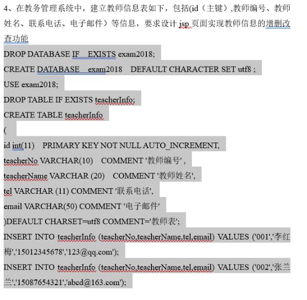
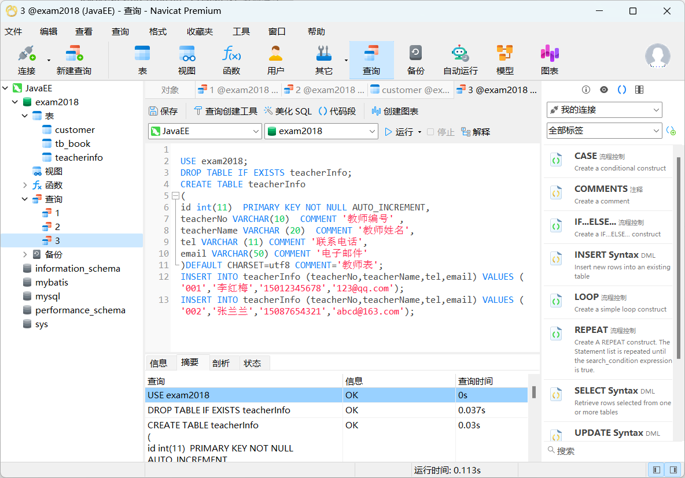
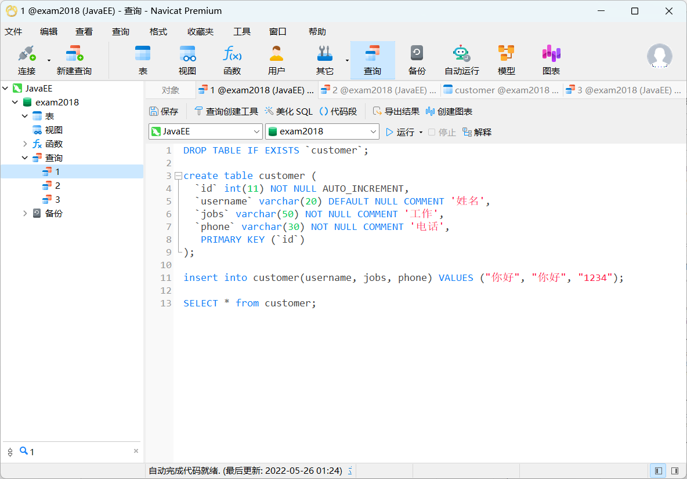
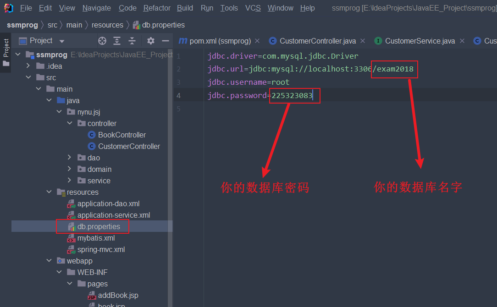
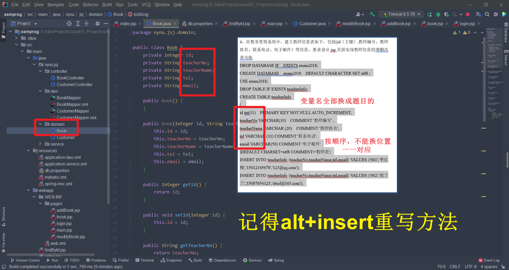
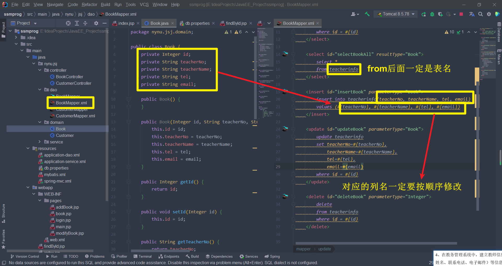
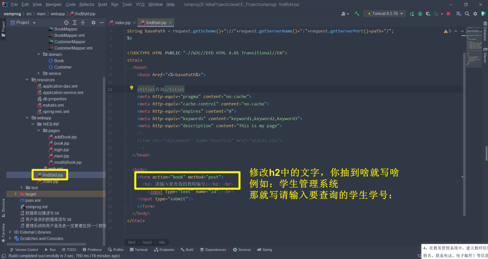
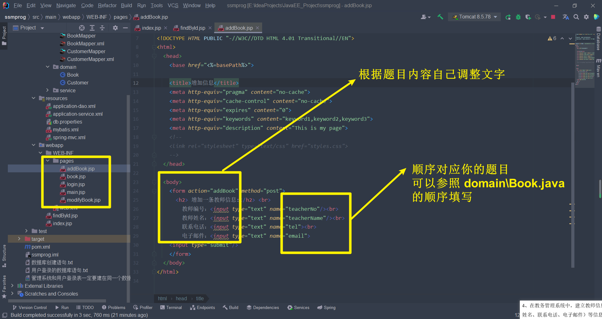
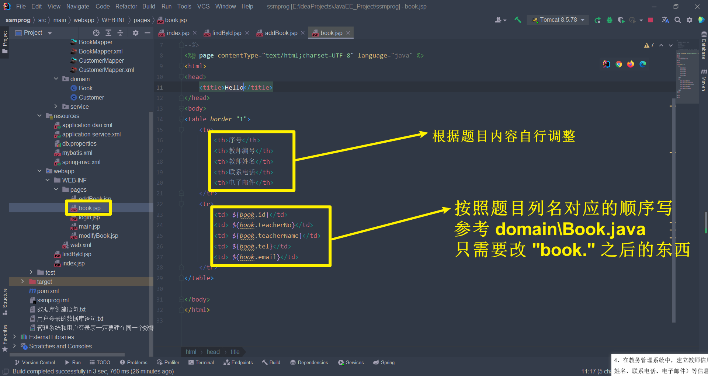
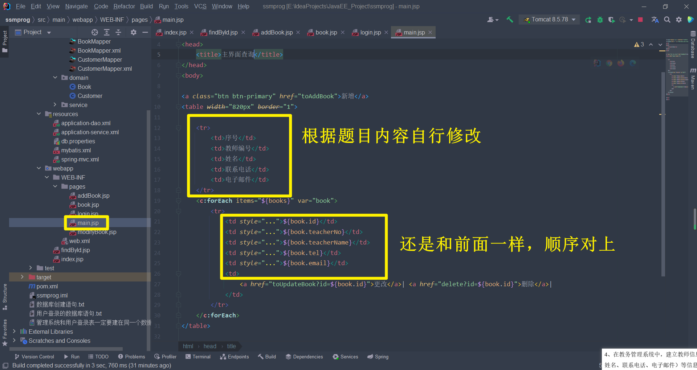

# 要改的地方

以第四题为例

 

# 1. 先创建数据库

# 2. 创建用户登录数据库

# 3. 修改数据库配置文件

 

# 4. 修改方法

# 5. 修改xml文件

# 6. 修改查询页面的文字

# 7.修改pages文件夹下所有的jsp页面

## 7.1 修改addBook

## 7.2 修改book

## 7.3 login不修改

## 7.4 修改main

## 7.5 修改modifyBook

